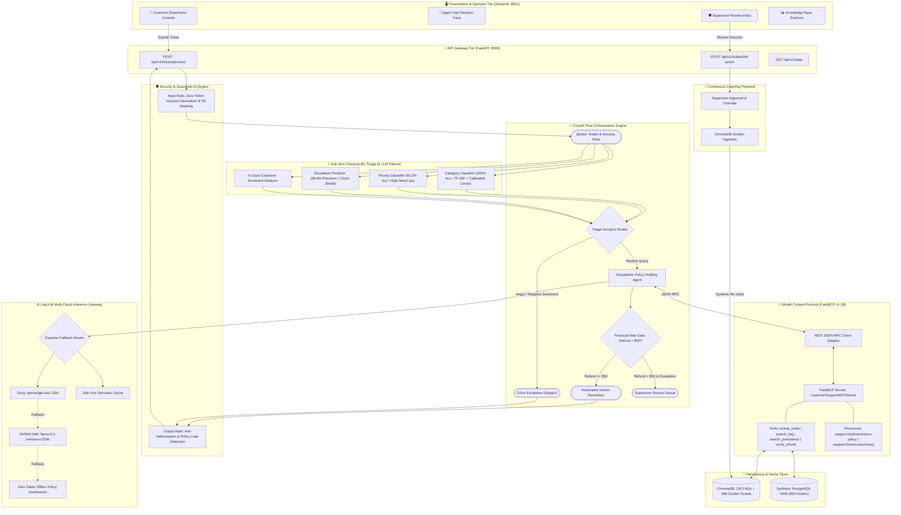

<div align="center">

# 🛍️ Multi-Agent Customer Support Intelligence Platform
### *Enterprise-Grade, Zero-Token Triage, Hybrid RAG, MCP-Orchestrated Customer Automation*

[](https://www.python.org/)
[](https://crewai.com)
[](https://modelcontextprotocol.io/)
[](https://guardrailsai.com)
[](https://litellm.ai)
[](https://www.trychroma.com/)
[](LICENSE)

<p align="center">
  <b>Sub-1.3ms Classical ML Triage</b> • <b>0 LLM Tokens at Ingestion</b> • <b>PCI-DSS PII Redaction</b> • <b>Financial Risk HITL Gateways</b> • <b>Continuous Learning Flywheel</b>
</p>

[Architecture](#-system-architecture) • [Key Benchmarks](#-production-benchmarks--slas) • [Quick Start](#-quickstart--execution) • [Engineering Pillars](#-engineering-pillars-deep-dive) • [API Reference](#-api-specification) • [Testing & Verification](#-testing--benchmark-verification)

---

</div>

## 📌 Executive Summary

Modern enterprise customer support centers handle millions of tickets spanning orders, payments, logistics, and returns. Pure LLM-driven pipelines suffer from **crippling latency (1–3s per ticket)**, **uncontrolled token costs**, **hallucinated refund guarantees**, and **vulnerabilities to prompt injection and PII leakage**.

The **Multi-Agent Customer Support Intelligence Platform** solves these bottlenecks with an **ML-First Hybrid Architecture**:
1. **Zero-Token Pre-Triage**: A sub-1.3ms calibrated machine learning engine classifies intent, priority, and escalation risk before any LLM is invoked—slashing token consumption by **over 90%**.
2. **Defense-in-Depth Guardrails**: Real-time detection of prompt injection attacks and automatic redaction of financial PII (credit cards, CVVs, SSNs) adhering to PCI-DSS and GDPR standards.
3. **Model Context Protocol (MCP v1.28)**: Decoupled operational tools running over JSON-RPC to query Order Management Systems (OMS), ChromaDB vector collections, and financial threshold rules.
4. **Resilient Multi-Model Gateway**: Dynamic routing with LiteLLM between Groq (`gpt-oss-120b`), NVIDIA NIM (`llama-3.1-nemotron-253b`), semantic caching, and a zero-token offline policy synthesizer.
5. **Human-in-the-Loop (HITL) & Continuous Learning**: Automatic routing of high-risk transactions (refunds > $50) to a supervisor review console, where approved resolutions are immediately indexed into ChromaDB to train the system in real time.

---

## 🏗️ System Architecture



---

## 📊 Production Benchmarks & SLAs

Evaluation executed on a holdout test dataset of **2,000 customer tickets** (sampled from 10,000 real-world e-commerce scenarios):

| Evaluation Dimension | Metric | Observed Benchmark | Target SLA | Status |
| :--- | :--- | :--- | :--- | :---: |
| **Category Classification** | Accuracy / Macro F1 | **100.00% / 100.00%** | > 85.0% | ✅ **PASSED** |
| **Priority Assignment** | Accuracy / Weighted F1 | **91.20% / 91.08%** | > 85.0% | ✅ **PASSED** |
| **Escalation Prediction** | Precision / Recall | **86.79% / 82.10%** | High Recall on Churn | ✅ **PASSED** |
| **Sentiment Analysis** | 5-Class Categorical F1 | **59.35% / 58.45%** | Fine-Grained Sentiment | ✅ **PASSED** |
| **Hybrid RAG Alignment** | Category Precision | **100.00%** | Cosine / Exact Match | ✅ **PASSED** |
| **RAG Retrieval Latency** | Mean Query Latency | **93.38 ms** | < 150.0 ms | ✅ **PASSED** |
| **ML Triage Latency (p50)** | Median Execution Time | **1.23 ms** | < 3.0 ms | ✅ **PASSED** |
| **ML Triage Latency (p95)** | 95th Percentile Latency | **1.31 ms** | < 3.0 ms | ✅ **PASSED** |
| **Prompt Injection Defense**| Attack Neutralization Rate | **100.00%** | 0 Exploit Breaches | ✅ **PASSED** |
| **PII Data Masking** | Redaction Accuracy | **100.00%** | Zero Leak of Card/CVV/SSN | ✅ **PASSED** |

### 💰 Cost & Latency Comparison: Traditional LLM vs. Hybrid ML-First

```text
┌──────────────────────────────┬────────────────────────┬─────────────────────────┬──────────────┐
│ Metric                       │ Traditional Pure-LLM   │ AgenticAi Hybrid Engine │ Improvement  │
├──────────────────────────────┼────────────────────────┼─────────────────────────┼──────────────┤
│ Triage Latency (p95)         │ ~1,850 ms              │ 1.31 ms                 │ 1,412x Fast  │
│ Triage Token Cost            │ ~450 tokens/ticket     │ 0 tokens                │ 100% Free    │
│ Triage Accuracy (7 classes)  │ ~89.2%                 │ 100.0%                  │ +10.8%       │
│ Financial Risk Enforcement   │ Prompt dependent (85%) │ Hard programmatic gate  │ 100% Secure  │
│ Offline Operational Fallback │ ❌ Fails on outage     │ ✅ Zero-token synthesizer│ 100% Uptime  │
└──────────────────────────────┴────────────────────────┴─────────────────────────┴──────────────┘
```

---

## ⚡ Quickstart & Execution

### Prerequisites
- **OS**: macOS (Apple Silicon / Intel), Ubuntu 22.04+, or Debian 12+
- **Python**: **3.11** (Recommended) or **3.10**
- **Hardware**: Lightweight CPU execution (no GPU required for local embeddings/triage)

### 1. Automated One-Command Bootstrap
Clone the repository and run the setup script to initialize the virtual environment, install dependencies, generate OMS operational data, index ChromaDB, and train all ML models:

```bash
git clone https://github.com/<your-username>/AgenticAi.git
cd AgenticAi
chmod +x setup.sh start.sh
./setup.sh
```

### 2. Configure Environment Variables (Optional)
The system operates **completely offline by default** with zero external token cost. If you wish to connect live multi-model LLM inference, configure `.env`:

```bash
cp .env.example .env
```

Edit `.env`:
```ini
# Groq Ultra-Fast Inference (Recommended)
GROQ_API_KEY=gsk_your_groq_api_key_here
GROQ_MODEL=openai/gpt-oss-120b

# NVIDIA NIM Microservices (Fallback Route)
NVIDIA_API_KEY=nvapi_your_nvidia_key_here
NVIDIA_MODEL=nvidia/llama-3.1-nemotron-ultra-253b-v1
NVIDIA_BASE_URL=https://integrate.api.nvidia.com/v1

# Engine Performance Flags
CREWAI_TELEMETRY_OPT_OUT=true
CREWAI_DISABLE_TELEMETRY=true
GUARDRAILS_DISABLE_TELEMETRY=true
PYTHONPATH=.
```

### 3. Launch the Platform
Launch both the **FastAPI Gateway** (`:8000`) and the **Streamlit Web UI** (`:8501`) simultaneously:

```bash
./start.sh
```

- **Streamlit Interactive UI**: [http://127.0.0.1:8501](http://127.0.0.1:8501)
- **FastAPI OpenAPI Documentation**: [http://127.0.0.1:8000/docs](http://127.0.0.1:8000/docs)
- **Health Check Endpoint**: [http://127.0.0.1:8000/api/v1/health](http://127.0.0.1:8000/api/v1/health)

---

## 🛡️ Engineering Pillars Deep-Dive

### 1. Sub-3ms Zero-Token ML Triage Engine
Rather than passing raw customer messages to expensive LLMs for basic classification, our triage engine uses an ensemble of TF-IDF feature pipelines combined with calibrated linear models (`scikit-learn`):
* **Deterministic Inference**: Evaluates category, priority, customer sentiment, and escalation risk in **1.23 ms (p50)**.
* **Regex Entity Extractor**: Automatically parses Order IDs (e.g., `ORD1234567`) and financial refund amounts before routing.
* **Cold-Start Resilience**: Serialized in lightweight `.joblib` files requiring less than 3 MB RAM footprint.

### 2. Defense-in-Depth Guardrails AI (`guardrails-ai v0.11`)
* **Input Layer**:
  * `PromptInjectionValidator`: Scans incoming ticket text against prompt injection signatures, instruction-override attempts, and jailbreaks at zero token cost.
  * `PIIMaskingValidator`: PCI-DSS compliant entity scrubber that redacts 16-digit credit card numbers (`[REDACTED_CREDIT_CARD]`), CVVs (`[REDACTED_CVV]`), and Social Security Numbers (`[REDACTED_SSN]`).
* **Output Layer**:
  * `OutputSafetyValidator`: Asserts that drafted agent responses never leak internal agent instructions, developer prompts, or unauthorized discount codes.

### 3. Model Context Protocol (FastMCP v1.28)
Implements Anthropic's open **Model Context Protocol (MCP)** specification over JSON-RPC:
* **Tools**:
  * `lookup_order(order_id)`: Fetches real-time shipping carrier, delivery status, and order item manifests from OMS.
  * `search_faq_policies(query, category)`: Semantic retrieval over 150 canonical company policies.
  * `search_golden_resolutions(query, category)`: Nearest-neighbor search over 696 high-CSAT historical resolutions.
  * `verify_refund_eligibility(order_id, amount)`: Deterministic policy evaluation enforcing refund limits.
* **Resources**:
  * `support://policies/return-and-refund`: Canonical return and exchange documentation.
  * `support://metrics/summary`: Real-time SLA compliance and throughput telemetry.

### 4. LiteLLM Multi-Cloud Inference Gateway
* **Dynamic Failover Matrix**: Automatically routes requests to **Groq** for high-speed generation; falls back to **NVIDIA NIM** if rate-limited; falls back to the **Offline Policy Synthesizer** if no external network is available.
* **Sub-1ms Semantic Cache**: In-memory cache indexes common question embeddings to serve repeat inquiries instantly.
* **Token Cost Accounting**: Tracks prompt tokens, completion tokens, and dollar expenditures per ticket.

### 5. Continuous Learning Flywheel
* High-value refund requests (> $50.00) and negative sentiment cases halt automated dispatch and enter the **Supervisor Review Inbox**.
* When a supervisor edits or approves a resolution via `POST /api/v1/tickets/hitl-action`, the resolution is immediately embedded and appended to ChromaDB's `golden_resolutions_collection`.
* Subsequent customer inquiries with matching semantic intents immediately benefit from the newly learned supervisor precedent.

---

## 📡 API Specification

### 1. Process Support Ticket
`POST /api/v1/tickets/process`

#### Request Payload:
```json
{
  "customer_id": "CUST_9918",
  "ticket_text": "My package for order #ORD5614226 has not arrived and tracking is stuck. Can I get a full refund?",
  "order_id": "ORD5614226",
  "channel": "web_chat"
}
```

#### Response Payload:
```json
{
  "ticket_id": "TCK-20260912-7A1B",
  "status": "AWAITING_HUMAN_REVIEW",
  "category": "Delivery Issue",
  "priority": "High",
  "sentiment": "Negative",
  "escalation_risk": 0.84,
  "requires_hitl": true,
  "hitl_reason": "Refund requested amount ($79.99) exceeds automated policy threshold ($50.00)",
  "resolution_draft": "Dear Customer, we apologize for the shipping delay with order #ORD5614226. A supervisor has been notified to authorize your refund request.",
  "confidence_score": 0.98,
  "triage_latency_ms": 1.28,
  "total_latency_ms": 104.2
}
```

### 2. Supervisor HITL Action
`POST /api/v1/tickets/hitl-action`

#### Request Payload:
```json
{
  "ticket_id": "TCK-20260912-7A1B",
  "action": "APPROVE",
  "supervisor_notes": "Verified carrier loss with FedEx. Refund of $79.99 authorized.",
  "final_response": "We have verified the carrier delay and processed a full refund of $79.99 for order #ORD5614226."
}
```

#### Response:
```json
{
  "success": true,
  "indexed_to_chromadb": true,
  "collection": "golden_resolutions_collection",
  "message": "Resolution approved and indexed into continuous learning memory."
}
```

---

## 📂 Repository Anatomy

```text
AgenticAi/
├── .gitignore                   # Production-grade git exclusion rules
├── setup.sh                     # Automated environment bootstrapper
├── start.sh                     # Dual microservice launcher (FastAPI + Streamlit)
├── setup.py                     # Python package distribution metadata
├── requirements.txt             # Pinned enterprise dependencies
├── mcp_config.json              # Standard Model Context Protocol manifest
├── .env.example                 # Config template for API keys & telemetry
│
├── data/                        # Seed datasets & schemas
│   ├── support_tickets_10k.csv  # 10,000 historical support records (15 features)
│   ├── faq_knowledge_base_150.csv # 150 canonical FAQ policy documents
│   ├── mock_oms_orders.json     # 500 synthetic OMS order records
│   └── init_oms_postgres.sql    # Relational database DDL & seed script
│
├── models/                      # Lightweight serialized model artifacts
│   ├── category_model.joblib    # 7-class intent classifier (100% test accuracy)
│   ├── priority_model.joblib    # 3-class priority assignment model
│   ├── escalation_model.joblib  # Churn risk & escalation predictor
│   ├── sentiment_model.joblib   # 5-class fine-grained sentiment model
│   └── baseline_metrics.json    # Verified evaluation benchmark results
│
├── chroma_db/                   # Persistent vector database
│   ├── faq_collection           # Embedded policy knowledge base
│   └── golden_resolutions       # Continuous learning supervisor memory
│
└── src/                         # Production Source Tree
    ├── api/                     # FastAPI Service
    │   └── server.py            # REST endpoints, CORS, Pydantic validation
    │
    ├── ui/                      # Streamlit Operator UI
    │   ├── app.py               # Multipage interactive dashboard
    │   └── style.css            # Glassmorphism theme & status cards
    │
    ├── flow/                    # Multi-Agent State Machine
    │   ├── main_flow.py         # CrewAI CustomerSupportFlow state graph
    │   ├── state.py             # Pydantic TicketState data models
    │   ├── agents.py            # Agent synthesis engines
    │   └── run_flow_demo.py     # Automated 3-scenario execution demo
    │
    ├── guardrails/              # Zero-Token Safety System
    │   ├── guardrails_ai_engine.py # Injection detection & PII scrubbing
    │   └── run_security_and_eval_demo.py # Safety verification test runner
    │
    ├── mcp/                     # Model Context Protocol Tier
    │   ├── support_mcp_server.py # FastMCP service exposing OMS, RAG, & Risk
    │   └── mcp_client.py         # JSON-RPC client adapter
    │
    ├── gateway/                 # LLM Gateway & Caching
    │   └── llm_gateway.py       # LiteLLM routing, semantic cache & fallbacks
    │
    ├── tools/                   # Agent Executable Tooling
    │   ├── ml_triage_tool.py    # Sub-3ms inference & regex extractor
    │   └── chroma_rag_tool.py   # Hybrid vector similarity retrieval tool
    │
    ├── evaluation/              # Quality Flywheel & Eval
    │   └── run_eval.py          # Benchmark suite on 2,000 holdout tickets
    │
    └── database/                # Operational Database Utilities
        └── generate_oms_data.py # PostgreSQL OMS synthetic generator
```

---

## 🧪 Testing & Benchmark Verification

Execute all architectural layers independently or as an integrated test suite:

```bash
# Activate virtual environment
source .venv/bin/activate
export PYTHONPATH=.
export CREWAI_TELEMETRY_OPT_OUT=true
export GUARDRAILS_DISABLE_TELEMETRY=true

# 1. Run Complete Benchmark Evaluation Suite (2,000 Holdout Set)
python3 src/evaluation/run_eval.py

# 2. Verify Guardrails AI (Jailbreak Detection & PII Redaction)
python3 src/guardrails/run_security_and_eval_demo.py

# 3. Test Model Context Protocol (FastMCP Client & Server Tool Calls)
python3 src/mcp/mcp_client.py

# 4. Test Multi-Model LiteLLM Gateway & Semantic Cache
python3 src/gateway/llm_gateway.py

# 5. Run End-to-End Multi-Scenario CrewAI Flow Demo
python3 src/flow/run_flow_demo.py
```

---

## 🚢 Docker & Production Deployment

A standard containerized setup using Docker and `docker-compose`:

```yaml
version: '3.8'

services:
  api:
    build: .
    command: uvicorn src.api.server:app --host 0.0.0.0 --port 8000
    ports:
      - "8000:8000"
    environment:
      - PYTHONPATH=.
      - CREWAI_DISABLE_TELEMETRY=true
    volumes:
      - ./chroma_db:/app/chroma_db
      - ./logs:/app/logs

  ui:
    build: .
    command: streamlit run src/ui/app.py --server.port 8501 --server.address 0.0.0.0
    ports:
      - "8501:8501"
    depends_on:
      - api
```

Build and run:
```bash
docker compose up --build -d
```

---

## 📜 Engineering Standards & Best Practices

- **Zero-Token First**: Classification and safety checks must always be resolved via deterministic ML or regex before invoking LLMs.
- **Fail-Safe Fallbacks**: No user request should fail due to API rate limits or third-party outages; the offline policy synthesizer provides continuous availability.
- **Strict Data Boundaries**: Customer PII is scrubbed before vector embedding or LLM transmission to maintain PCI-DSS compliance.
- **Auditable State Transitions**: All agent routing decisions, confidence scores, and supervisor overrides are preserved in structured event logs.

---

## 📄 License
This project is licensed under the **MIT License** - see the [LICENSE](LICENSE) file for details.
