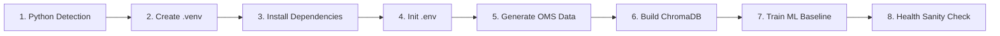

# 📖 Setup & Installation Guide

Complete documentation for setting up, configuring, troubleshooting, and deploying the **Multi-Agent Customer Support Intelligence Platform**.

---

## 📋 Table of Contents
1. [System Prerequisites](#1-system-prerequisites)
2. [What the Setup File (`setup.sh`) Does](#2-what-the-setup-file-setupsh-does)
3. [One-Command Quickstart](#3-one-command-quickstart)
4. [Manual Step-by-Step Installation](#4-manual-step-by-step-installation)
5. [Environment Variables (`.env`) Reference](#5-environment-variables-env-reference)
6. [Component Verification & Sanity Checks](#6-component-verification--sanity-checks)
7. [Troubleshooting Guide](#7-troubleshooting-guide)
8. [Production Deployment (Docker & Server)](#8-production-deployment-docker--server)

---

## 1. System Prerequisites

Before running the setup, ensure your system meets the following requirements:

| Component | Requirement | Notes |
| :--- | :--- | :--- |
| **Operating System** | macOS (Apple Silicon / Intel), Ubuntu 22.04+, or Debian 12+ | Tested on macOS Darwin with arm64 & x86_64. |
| **Python Version** | **Python 3.10 or Python 3.11** (Recommended: `3.11.x`) | *Important:* Python 3.9 lacks PEP 604 union typing required by modern CrewAI. |
| **Package Manager** | `pip` (bundled with Python) | Will be auto-upgraded during setup. |
| **Disk Space** | $\ge 2.5\text{ GB}$ free disk space | For virtualenv, PyTorch/ONNX wheels, and ChromaDB embeddings. |
| **RAM** | $\ge 4\text{ GB}$ (8 GB recommended) | Lightweight: all local embeddings run efficiently on CPU. |

---

## 2. What the Setup File (`setup.sh`) Does

The [`setup.sh`](setup.sh) script automates the complete initialization of the project in 8 deterministic steps:



### Step-by-Step Automation Breakdown:
1. **Python Detection**: Automatically checks for `/opt/homebrew/bin/python3.11`, `python3.11`, `python3.10`, or `python3` to ensure a compatible interpreter is selected.
2. **Virtual Environment**: Initializes an isolated `.venv/` to prevent conflicts with global system packages.
3. **Dependency Installation**: Upgrades `pip` and installs all packages pinned in [`requirements.txt`](requirements.txt) (`scikit-learn`, `chromadb`, `crewai`, `fastapi`, `streamlit`, `guardrails-ai`, `litellm`, `mcp`). *Note:* `psycopg2-binary` is made an optional extra in `setup.py` (`pip install -e .[postgres]`), keeping the core local install lightweight and pure Python.
4. **Environment Initialization**: Creates `.env` from [`.env.example`](.env.example) if not already present.
5. **Operational Data Generation**: Runs `src/database/generate_oms_data.py` to synthesize 500 realistic e-commerce orders (`data/mock_oms_orders.json` and `data/init_oms_postgres.sql`).
6. **ChromaDB Vector Store Ingestion**: Runs `src/rag/build_chroma_knowledge_base.py` to embed the 150 FAQs and 696 high-satisfaction historical tickets into `chroma_db/`.
7. **ML Model Training**: Runs `src/models/train_baseline_models.py` on the 10,000 tickets to serialize all 4 high-speed inference models (`models/*.joblib`).
8. **Permission Setup**: Pre-configures local application support storage paths required by CrewAI's LanceDB backend.

---

## 3. One-Command Quickstart

### Step 1: Run Setup
Open your terminal in the project root directory and run:
```bash
./setup.sh
```

### Step 2: Start the System
Once setup completes, launch both the FastAPI backend and Streamlit UI with:
```bash
./start.sh
```

### Step 3: Access the Applications
* **Streamlit Interactive UI**: [http://127.0.0.1:8501](http://127.0.0.1:8501)
* **FastAPI Swagger Docs**: [http://127.0.0.1:8000/docs](http://127.0.0.1:8000/docs)
* **API Health Endpoint**: [http://127.0.0.1:8000/api/v1/health](http://127.0.0.1:8000/api/v1/health)

---

## 4. Manual Step-by-Step Installation

If you prefer executing each step manually instead of running `setup.sh`:

### 1. Create Virtual Environment
```bash
python3.11 -m venv .venv
source .venv/bin/activate
```

### 2. Install Dependencies
```bash
pip install --upgrade pip
pip install -r requirements.txt
```

### 3. Generate Operational OMS Data
```bash
PYTHONPATH=. python3 src/database/generate_oms_data.py
```

### 4. Build the ChromaDB Vector Collections
```bash
PYTHONPATH=. python3 src/rag/build_chroma_knowledge_base.py
```

### 5. Train Baseline Machine Learning Models
```bash
PYTHONPATH=. python3 src/models/train_baseline_models.py
```

### 6. Start the Services

**Terminal 1: FastAPI Backend**
```bash
source .venv/bin/activate
export PYTHONPATH=.
export CREWAI_DISABLE_TELEMETRY=true
uvicorn src.api.server:app --host 127.0.0.1 --port 8000 --reload
```

**Terminal 2: Streamlit Interactive UI**
```bash
source .venv/bin/activate
export PYTHONPATH=.
streamlit run src/ui/app.py --server.port 8501
```

---

## 5. Environment Variables (`.env`) Reference

The system operates **completely offline by default** with zero external API dependencies via its deterministic ML triage and policy synthesis engine. 

If you wish to enable live high-speed LLM generation or cloud observability, configure `.env`:

```bash
# ------------------------------------------------------------------------------
# High-Speed LLM Providers (via LiteLLM Multi-Model Gateway)
# ------------------------------------------------------------------------------
# Groq Ultra-Fast Inference
GROQ_API_KEY=gsk_...
GROQ_MODEL=openai/gpt-oss-120b

# NVIDIA NIM Microservices
NVIDIA_API_KEY=nvapi-...
NVIDIA_MODEL=nvidia/llama-3.1-nemotron-ultra-253b-v1
NVIDIA_BASE_URL=https://integrate.api.nvidia.com/v1


# Alternative LLM Providers (Optional)
OPENAI_API_KEY=sk-...
GEMINI_API_KEY=AIzaSy...
ANTHROPIC_API_KEY=sk-ant-...

# ------------------------------------------------------------------------------
# Core Engine Performance & Offline Optimization
# ------------------------------------------------------------------------------
CREWAI_TELEMETRY_OPT_OUT=true   # Disables background external telemetry calls
CREWAI_DISABLE_TELEMETRY=true   # Suppresses CrewAI external network telemetry
POSTHOG_DISABLED=1              # Disables external PostHog network retries
GUARDRAILS_DISABLE_TELEMETRY=true # Suppresses Guardrails AI background telemetry
PYTHONPATH=.                    # Ensures local module imports resolve cleanly

# ------------------------------------------------------------------------------
# Langfuse v4 LLM Observability & Tracing (Installed from github.com/langfuse/skills)
# ------------------------------------------------------------------------------
LANGFUSE_PUBLIC_KEY=pk-lf-...   # Project Public Key from https://cloud.langfuse.com
LANGFUSE_SECRET_KEY=sk-lf-...   # Project Secret Key
LANGFUSE_HOST=https://cloud.langfuse.com
LANGFUSE_OTEL_HOST=https://cloud.langfuse.com
```


---

## 6. Component Verification & Sanity Checks

Run these commands inside your virtual environment to verify that each architectural layer is functioning properly:

### 1. Test ML Baseline Models (Sub-3ms Triage)
```bash
PYTHONPATH=. .venv/bin/python3 -c "
from src.tools.ml_triage_tool import MLTicketTriageTool
t = MLTicketTriageTool()
res = t.triage('Where is my package for order #ORD5614226?')
print('Triage Verified:', res['ticket_category'], '| Priority:', res['priority'], '| Latency:', res['inference_time_ms'], 'ms')
"
```
*Expected Output:* `Triage Verified: Delivery Issue | Priority: Medium | Latency: ~1.2 ms`

### 2. Test Model Context Protocol (MCP v1.28) Server & Client Adapter
```bash
PYTHONPATH=. .venv/bin/python3 src/mcp/mcp_client.py
```
*Expected Output:* Discovers all 4 MCP tools (`lookup_order`, `search_faq_policies`, `search_golden_resolutions`, `verify_refund_eligibility`) and 2 MCP resources, then runs live test tool calls.

### 3. Test Official LiteLLM Gateway & Semantic Cache
```bash
PYTHONPATH=. .venv/bin/python3 src/gateway/llm_gateway.py
```
*Expected Output:* Tests Groq / NVIDIA NIM routing, verifies semantic cache hit rate, and confirms graceful offline fallback.

### 4. Test ChromaDB Hybrid Retrieval
```bash
PYTHONPATH=. .venv/bin/python3 -c "
from src.tools.chroma_rag_tool import ChromaHybridRAGTool
r = ChromaHybridRAGTool()
res = r.retrieve('What is the return window for electronics?')
print('Retrieved', res['count'], 'items | Top source:', res['results'][0]['id'])
"
```
*Expected Output:* `Retrieved 4 items | Top source: FAQ016 (or relevant precedent)`

### 5. Test Guardrails AI Security (Injection Defense & PII Masking)
```bash
PYTHONPATH=. .venv/bin/python3 src/guardrails/run_security_and_eval_demo.py
```
*Expected Output:* Blocks adversarial prompt injection with 0 tokens and redacts Credit Card / CVV PII tokens.

### 6. Test Full CrewAI Flow Across 3 Primary Scenarios
```bash
PYTHONPATH=. .venv/bin/python3 src/flow/run_flow_demo.py
```
*Expected Output:* Executes Scenario 1 (Auto-resolved Delivery), Scenario 2 (High-Value Return HITL Gate), and Scenario 3 (Crisis Escalation Dispatch).

### 7. Run Comprehensive Evaluation Suite (Holdout Test Set)
```bash
PYTHONPATH=. .venv/bin/python3 src/evaluation/run_eval.py
```
*Expected Output:* 100.0% Category Accuracy, 91.20% Priority Accuracy, 86.79% Escalation Precision, 1.25 ms p50 Latency.

---

## 7. Troubleshooting Guide

### Issue 1: `TypeError: unsupported operand type(s) for |: 'type' and 'NoneType'`
* **Cause:** The active Python version is Python 3.9 or older, which does not support PEP 604 type unions.
* **Fix:** Ensure Python 3.10 or 3.11 is installed. Re-create the virtual environment:
  ```bash
  rm -rf .venv
  /opt/homebrew/bin/python3.11 -m venv .venv
  ./setup.sh
  ```

### Issue 2: `PermissionError: [Errno 1] Operation not permitted: .../Library/Application Support/AgenticAi`
* **Cause:** macOS sandbox restriction preventing CrewAI's LanceDB storage path creation.
* **Fix:** Run the following command once to pre-create the directory:
  ```bash
  mkdir -p "$HOME/Library/Application Support/AgenticAi/memory"
  ```
  *(This is already handled automatically in `setup.sh` and `start.sh`)*.

### Issue 3: `Address already in use` on Port 8000 or 8501
* **Cause:** A previous instance of Uvicorn or Streamlit is still running in the background.
* **Fix:** Kill the existing process:
  ```bash
  lsof -ti:8000 | xargs kill -9 2>/dev/null || true
  lsof -ti:8501 | xargs kill -9 2>/dev/null || true
  ```

### Issue 4: Slow Execution / Telemetry Timeout
* **Cause:** CrewAI attempting to reach `telemetry.crewai.com` in an offline or sandboxed environment.
* **Fix:** Ensure `CREWAI_DISABLE_TELEMETRY=true` is exported in your terminal or `.env`. This stops CrewAI from attempting external telemetry calls while leaving Langfuse OpenTelemetry completely enabled and intact.

---

## 8. Production Deployment (Docker & Server)

### Running with Docker

Create a `Dockerfile` in the project root:

```dockerfile
FROM python:3.11-slim

WORKDIR /app

# Install system utilities
RUN apt-get update && apt-get install -y --no-install-recommends \
    build-essential \
    curl \
    && rm -rf /var/lib/apt/lists/*

# Copy dependencies
COPY requirements.txt .
RUN pip install --no-cache-dir --upgrade pip && \
    pip install --no-cache-dir -r requirements.txt

# Copy application source and data
COPY . .

# Build data, vectors, and models during build
RUN python3 src/database/generate_oms_data.py && \
    python3 src/rag/build_chroma_knowledge_base.py && \
    python3 src/models/train_baseline_models.py

EXPOSE 8000 8501

# Start both servers via start.sh
RUN chmod +x setup.sh start.sh
CMD ["./start.sh"]
```

### Build & Run Container:
```bash
docker build -t customer-support-intel .
docker run -p 8000:8000 -p 8501:8501 customer-support-intel
```
